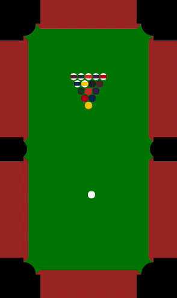

# pool-sim

A simulator for the game [Pool](https://en.wikipedia.org/wiki/Pool_(cue_sports)).

# Results

I implemented several different agents, including a random search agent. Here are some statistics about matches between these agents:

| Player 0     | Player 1     | Mean Winner    | Turns | Scratches | Live Balls |
|--------------|--------------|----------------|-------|-----------|------------|
| Search       | AimClosest   | 0.024          | 30.7  | 2.20      | 3.36       |
| Search       | Search       | 0.521          | 30.4  | 2.31      | 0.54       |
| FastRandom   | Random       | 0.802          | 84.5  | 57.1      | 6.70       |

# Status

Here's what's done so far:

 * A physics simulator
 * A set of rules implemented on top of the physics simulator
 * A few basic agents
 * A demo that shows an agent playing against itself
 * A script to match off two agents repeatedly
